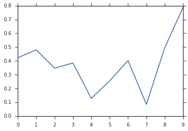
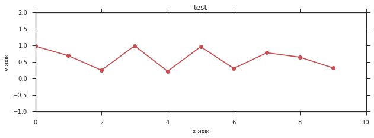
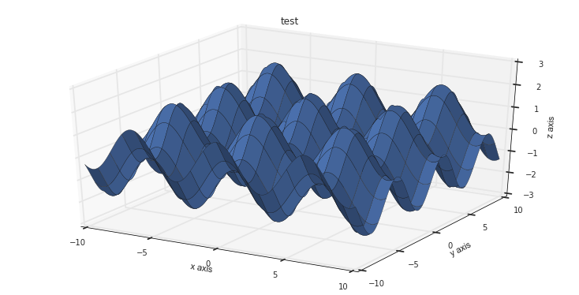
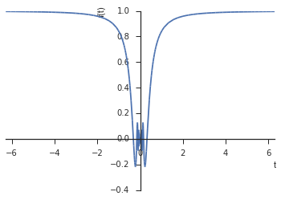
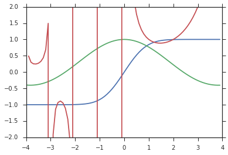
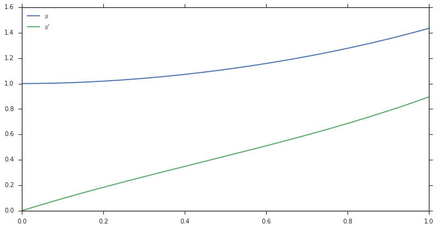
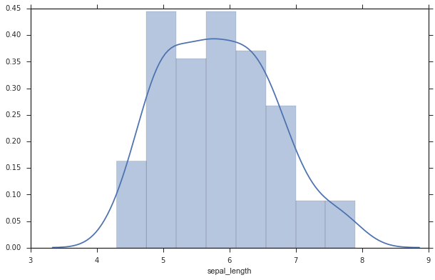
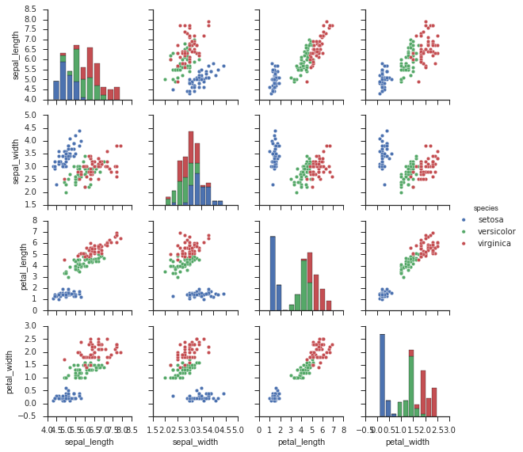

<center>

</center>

# Python

- Python is a general purpose programming language with a wide variety of uses

- Numerical packages largely based on Matlab

- Interpreted, not compiled

- No need to declare variable typee

- Semicolon only necessary if you want to supress output

# Basic Math


```python
# Nice arithmetic
50+2*3
```


    56


```python
# Floating Point arithmetic
13/3
```


    4.333333333333333


```python
# Integer (floor) division
13//3
```


$$4$$


```python
# Fortran-like ** for exponentiation
4**5
```


$$1024$$


# Strings

* Double or single quotes are okay


```python
name = "Oliver"
greeting = "Hi, "
state = "wonderful"
```


```python
# String formatting
print("Hi, {}! How are you? It's a {} day.".format(name,state))
```

    Hi, Oliver! How are you? It's a wonderful day.


# Lists


```python
# Mixed-type lists
a=["string!",'also a string!',123.14,[1,3,5]]
print(a)
```

    ['string!', 'also a string!', 123.14, [1, 3, 5]]


```python
# Index from 0
a[0]
"string"+str(123)
```


    'string123'


```python
# List assignment
a[1]="Second element!"
print(a)
```

    ['string!', 'Second element!', 123.14, [1, 3, 5]]


```python
# List of lists
a[3][2]
```


$$5$$


# Slices
`list[first element in slice:first element NOT in slice:step]`


```python
colors = ['yellow','blue','red','green','magenta','white']
colors[1:3]
```


    ['blue', 'red']


```python
colors[2:]
```


    ['red', 'green', 'magenta', 'white']


```python
colors[:3]
```


    ['yellow', 'blue', 'red']


# Negative Indexing


```python
colors = ['yellow','blue','red','green','magenta','white']
colors[-1]
```


    'white'


```python
colors[2:-2]
```


    ['red', 'green']


```python
colors[-1:1:-1]
```


    ['white', 'magenta', 'green', 'red']


# Everything is an Object!


```python
# Strings are objects
s = "This is a great string!"
s.split()
```


    ['This', 'is', 'a', 'great', 'string!']


```python
# Append
favorite_things=['cats','dogs','ice cream']
favorite_things.append('asparagus')
print(favorite_things)
```

    ['cats', 'dogs', 'ice cream', 'asparagus']


```python
# What's inside?
dir(s)[-11:]
s.swapcase
```


    <function str.swapcase>


# The Colon: Indentation

* Python loops, conditionals and functions begin with a colon

* Indentation is essential

* No end statement necessary


```python
a = 1

if -3 <= a and a < 0:
    print("Case I")
    a *=6
elif 0 <= a and a < 20:
    print("Case II")
    a += 10
else:
    print("Case III")
```

    Case II


```python
x = 0
while x < 6 or x % 2 == 0:
    print(x)
    x += 1
```

    0
    1
    2
    3
    4
    5
    6


# Iterating through lists


```python
x = [3,6,'string',[1,2,3]]
```


```python
print("Simple loop")
for y in x:
    print(y)
```

    Simple loop
    3
    6
    string
    [1, 2, 3]


```python
print("Enumerate:")
enumerate(x)
#for i,y in enumerate(x):
#    print(i,y)
```

    Enumerate:


    <enumerate at 0x2b667625c2d0>


# List comprehensions

* Easily create lists in a foor loop

* "Syntactic sugar"


```python
a = [1,2,3]
a
```


$$\left [ 1, \quad 2, \quad 3\right ]$$


```python
b = [x**2 for x in a]
b
```


$$\left [ 1, \quad 4, \quad 9\right ]$$


```python
b = [0,0,0]
for i 
```


```python
b
```


$$\left [ 1, \quad 4, \quad 9\right ]$$


```python
c = [ [x+y for y in b] for x in a]
c
```


$$\left [ \left [ 2, \quad 5, \quad 10\right ], \quad \left [ 3, \quad 6, \quad 11\right ], \quad \left [ 4, \quad 7, \quad 12\right ]\right ]$$


# Tuples - Immutable Lists


```python
b=(1,5,3)
b
```


$$\left ( 1, \quad 5, \quad 3\right )$$


```python
b[1]
```


$$5$$


```python
b[2]=0
```


    ---------------------------------------------------------------------------

    TypeError                                 Traceback (most recent call last)

    <ipython-input-250-568650d742ab> in <module>()
    ----> 1 b[2]=0
    

    TypeError: 'tuple' object does not support item assignment


# Dicts - Custom-index Lists


```python
petal_length = {'daisies': 15.4, 'roses': 19.2, 'begonias': 2.3}
```


```python
petal_length['daisies']
```


$$15.4$$


```python
print(petal_length.keys())
print(petal_length.values())
```

    dict_keys(['begonias', 'roses', 'daisies'])
    dict_values([2.3, 19.2, 15.4])


# Sets - Unordered lists


```python
integers = {1,2,3,4,5}
rationals = {1.2,4.0,2.9,5.6,3.0}
```


```python
integers | rationals
```


$$\left\{1, 1.2, 2, 2.9, 3, 4, 5, 5.6\right\}$$


```python
integers & rationals
```


$$\left\{3.0, 4.0\right\}$$


```python
integers - rationals
```


$$\left\{1, 2, 5\right\}$$


```python
rationals - integers
```


$$\left\{1.2, 2.9, 5.6\right\}$$


# Functions

* Functions are defined with the `def` keyword


```python
def weather(day,time='noon'):
    if(day in ('Friday','Saturday','Sunday')):
        print("The weather is beautiful this {} at {}. It's the weekend!".format(day,time))
    elif day == 'Monday':
        print("Back to school! The weather's alright this {} at {}".format(day,time))
    else:
        print("It's Ohio, who knows what the weather is like this {} at {}".format(day,time))
        
```


```python
weather(10)
```

    It's Ohio, who knows what the weather is like this 10 at noon


```python
weather('Monday')
```

    Back to school! The weather's alright this Monday at noon


```python
weather(23,92)
```

    It's Ohio, who knows what the weather is like this 23 at 92


# Imports

`import package`
    - package.feature()

`import package as pkg`
    - pkg.feature()

`from package import feature,other_thing`  
`from package import *`
    - feature()

# Numpy


```python
from numpy import *
```


```python
a = arange(2,20,0.5)
print(a)
```

    [  2.    2.5   3.    3.5   4.    4.5   5.    5.5   6.    6.5   7.    7.5
       8.    8.5   9.    9.5  10.   10.5  11.   11.5  12.   12.5  13.   13.5
      14.   14.5  15.   15.5  16.   16.5  17.   17.5  18.   18.5  19.   19.5]


```python
#zeros([10,3])
```


```python
x=array([[1,2,3],[4,5,6],[7,8,9]])
print(x)
```

    [[1 2 3]
     [4 5 6]
     [7 8 9]]


```python
arange(8).reshape([2,2,2])
```


    array([[[0, 1],
            [2, 3]],
    
           [[4, 5],
            [6, 7]]])


## Array operations are _elementwise_ by default

##### That means no dots needed as in Matlab (.* .^ ./ etc.)


```python
A=arange(25).reshape([5,5])
print()

b=arange(5,10).reshape([5,1])
```

    


\begin{equation}
    \left[\begin{matrix}0.0 & 1.0 & 2.0 & 3.0 & 4.0\\5.0 & 6.0 & 7.0 & 8.0 & 9.0\\10.0 & 11.0 & 12.0 & 13.0 & 14.0\\15.0 & 16.0 & 17.0 & 18.0 & 19.0\\20.0 & 21.0 & 22.0 & 23.0 & 24.0\end{matrix}\right] \left[\begin{matrix}5.0\\6.0\\7.0\\8.0\\9.0\end{matrix}\right] \; = \quad ?
\end{equation}

### Elementwise


```python
A*b
```


    array([[  0,   5,  10,  15,  20],
           [ 30,  36,  42,  48,  54],
           [ 70,  77,  84,  91,  98],
           [120, 128, 136, 144, 152],
           [180, 189, 198, 207, 216]])


### Matrix multiplication


```python
A@b
```


    array([[ 80],
           [255],
           [430],
           [605],
           [780]])


# Beware: rank 1 arrays

* Transpose is a matrix operation, not a vector operation


```python
a1=arange(10).T
a1
```


    array([0, 1, 2, 3, 4, 5, 6, 7, 8, 9])


```python
a2=arange(10).reshape([1,10])
a2
```


    array([[0, 1, 2, 3, 4, 5, 6, 7, 8, 9]])


```python
a2.T
```


    array([[0],
           [1],
           [2],
           [3],
           [4],
           [5],
           [6],
           [7],
           [8],
           [9]])


# Element-wise boolean operations


```python
arr = arange(10)
arr
```


    array([0, 1, 2, 3, 4, 5, 6, 7, 8, 9])


```python
bool1 = (arr == 3)
bool1
```


    array([False, False, False,  True, False, False, False, False, False, False], dtype=bool)


```python
bool2 = (arr<3)
bool2
```


    array([ True,  True,  True, False, False, False, False, False, False, False], dtype=bool)


```python
arr[bool2]
```


    array([0, 1, 2])


# Matplotlib


```python
from matplotlib.pyplot import *
```


```python
plot(random.rand(10))
```


    [<matplotlib.lines.Line2D at 0x2b6676407470>]





# IPython magics are like super-commands

### Most important:

`%pylab inline`

* `from numpy import *`

* `from matplotlib.pyplot import *`

* All plots will show inline

* Doesn't work in regular python script, only in a notebook

# Figure control


```python
%pylab inline
```

    Populating the interactive namespace from numpy and matplotlib


```python
figure(figsize=[10,3])
plot(random.rand(10),'or-')
title("test")
xlim(0,10)
ylim(-1,2)
xlabel("x axis")
ylabel("y axis")
```


    <matplotlib.text.Text at 0x2b665c65be10>





# Matplotlib 3D


```python
from mpl_toolkits.mplot3d import Axes3D
fig = figure(figsize=[10,5])
ax = Axes3D(fig)
x=arange(-10,10,0.1)
y=arange(-10,10,0.1)
x,y = meshgrid(x,y)
z = cos(x) + sin(y)
```


```python
ax.plot_surface(x,y,z)
title("test")
xlim(-10,10)
ylim(-10,10)
ax.set_zlim3d([-3,3])
xlabel("x axis")
ylabel("y axis")
ax.set_zlabel("z axis")
```


    <matplotlib.text.Text at 0x2b665c7cd358>





# Vispy 3D


```python
import vispy_surf as vp
x = arange(-3,3,0.01)
y = arange(-3,3,0.01)
def f(x,y):
    r = sqrt(x**2+y**2)
    return sinc(r)

vp.surf(x,y,f)
```

# Sympy


```python
import sympy as sym
sym.init_printing()
```


```python
def f(x): return x*sym.sin(1/x)
```


```python
t = sym.var('t')
sym.plot(f(t),(t,-2*sym.pi,2*sym.pi))
```





    <sympy.plotting.plot.Plot at 0x2b666e723748>


 # Calculus with Sympy


```python
sym.limit(f(t),t,0)
```


$$0$$


```python
sym.diff(f(t),t)
```


$$\sin{\left (\frac{1}{t} \right )} - \frac{1}{t} \cos{\left (\frac{1}{t} \right )}$$


```python
sym.integrate(f(t),(t,-1,1))
```


$$\cos{\left (1 \right )} + \sin{\left (1 \right )} + \operatorname{Si}{\left (1 \right )}$$


# Algebra with Sympy


```python
expr=(1+t)*(1-t) + sym.sin(sym.acos(t))
expr
```


$$\left(- t + 1\right) \left(t + 1\right) + \sqrt{- t^{2} + 1}$$


```python
sym.simplify(expr)
```


$$- t^{2} + \sqrt{- t^{2} + 1} + 1$$


# Scipy

## Special Functions


```python
from scipy.special import erf,j0,gamma
```


```python
x=arange(-4,4,0.1)
plot(x,erf(x),x,j0(x),x,gamma(x));
axis([-4,4,-2,2]);
```





# ODE Solvers


```python
### Comparable to ode45 / ode15s, depending on mode
from scipy.integrate import odeint,ode
```

#### <center> 2nd Order ODE
<sub>
\begin{align}
y''(x) &= y^2 + y' \\
y(0) &= 1 \\
y'(0) &= 0 \\
x & \in [0,5]
\end{align}
</sub>
</center>


```python
# Declare the model
def rhs(y, t):
    dy=[0,0]
    dy[0] = y[1]
    dy[1] = y[0]**2 - y[1]
    return dy
time = arange(0,1,1e-4)
yinit = array([1.0, 0.0])
```


```python
y = odeint(rhs, yinit, time)

figure(figsize=[12,6])
plot(time,y[:,0])
plot(time,y[:,1])
legend(["$y$","$y'$"],loc='best');
```





```
#Stiff (almost)
dt=1e-4
ode15s = ode(rhs)
ode15s.set_integrator('vode', method='bdf', order=15, nsteps=3000)
ode15s.set_initial_value(yinit,time[0])
i=0
while ode15s.successful() and ode15s.t <= time[-1]:
    y[i,:] = ode15s.integrate(ode15s.t+dt)
```

# Pandas


```python
import pandas as pd
pd.options.display.max_rows=10
```


```python
names = ['Frank','Maddy','Claire']
attributes = ['height','weight','shirt size','nose length','typing speed','grade']
data = random.randint(10,20,[3,6])
df = pd.DataFrame(data,index=names,columns=attributes)
```


```python
df
```


<div>
<table border="1" class="dataframe">
  <thead>
    <tr style="text-align: right;">
      <th></th>
      <th>height</th>
      <th>weight</th>
      <th>shirt size</th>
      <th>nose length</th>
      <th>typing speed</th>
      <th>grade</th>
    </tr>
  </thead>
  <tbody>
    <tr>
      <th>Frank</th>
      <td>17</td>
      <td>13</td>
      <td>10</td>
      <td>14</td>
      <td>13</td>
      <td>18</td>
    </tr>
    <tr>
      <th>Maddy</th>
      <td>11</td>
      <td>10</td>
      <td>18</td>
      <td>19</td>
      <td>10</td>
      <td>10</td>
    </tr>
    <tr>
      <th>Claire</th>
      <td>13</td>
      <td>11</td>
      <td>18</td>
      <td>19</td>
      <td>14</td>
      <td>16</td>
    </tr>
  </tbody>
</table>
</div>


# Seaborn


```python
import seaborn as sns
sns.set(style="ticks", color_codes=True)
```


```python
iris = sns.load_dataset("iris")
iris
```


<div>
<table border="1" class="dataframe">
  <thead>
    <tr style="text-align: right;">
      <th></th>
      <th>sepal_length</th>
      <th>sepal_width</th>
      <th>petal_length</th>
      <th>petal_width</th>
      <th>species</th>
    </tr>
  </thead>
  <tbody>
    <tr>
      <th>0</th>
      <td>5.1</td>
      <td>3.5</td>
      <td>1.4</td>
      <td>0.2</td>
      <td>setosa</td>
    </tr>
    <tr>
      <th>1</th>
      <td>4.9</td>
      <td>3.0</td>
      <td>1.4</td>
      <td>0.2</td>
      <td>setosa</td>
    </tr>
    <tr>
      <th>2</th>
      <td>4.7</td>
      <td>3.2</td>
      <td>1.3</td>
      <td>0.2</td>
      <td>setosa</td>
    </tr>
    <tr>
      <th>3</th>
      <td>4.6</td>
      <td>3.1</td>
      <td>1.5</td>
      <td>0.2</td>
      <td>setosa</td>
    </tr>
    <tr>
      <th>4</th>
      <td>5.0</td>
      <td>3.6</td>
      <td>1.4</td>
      <td>0.2</td>
      <td>setosa</td>
    </tr>
    <tr>
      <th>...</th>
      <td>...</td>
      <td>...</td>
      <td>...</td>
      <td>...</td>
      <td>...</td>
    </tr>
    <tr>
      <th>145</th>
      <td>6.7</td>
      <td>3.0</td>
      <td>5.2</td>
      <td>2.3</td>
      <td>virginica</td>
    </tr>
    <tr>
      <th>146</th>
      <td>6.3</td>
      <td>2.5</td>
      <td>5.0</td>
      <td>1.9</td>
      <td>virginica</td>
    </tr>
    <tr>
      <th>147</th>
      <td>6.5</td>
      <td>3.0</td>
      <td>5.2</td>
      <td>2.0</td>
      <td>virginica</td>
    </tr>
    <tr>
      <th>148</th>
      <td>6.2</td>
      <td>3.4</td>
      <td>5.4</td>
      <td>2.3</td>
      <td>virginica</td>
    </tr>
    <tr>
      <th>149</th>
      <td>5.9</td>
      <td>3.0</td>
      <td>5.1</td>
      <td>1.8</td>
      <td>virginica</td>
    </tr>
  </tbody>
</table>
<p>150 rows × 5 columns</p>
</div>


```python
figure(figsize=[10,6])
sns.distplot(iris['sepal_length']);
```





```python
sns.pairplot(iris,hue='species',size=2);
```





# <center>Try it out!</center>

# Installing Python

* Google "Miniconda" & install

* Open a command prompt

Run:  
- `conda install jupyter numpy matplotlib scipy sympy pandas`

* Should finish in < 10 min.


```python

```
